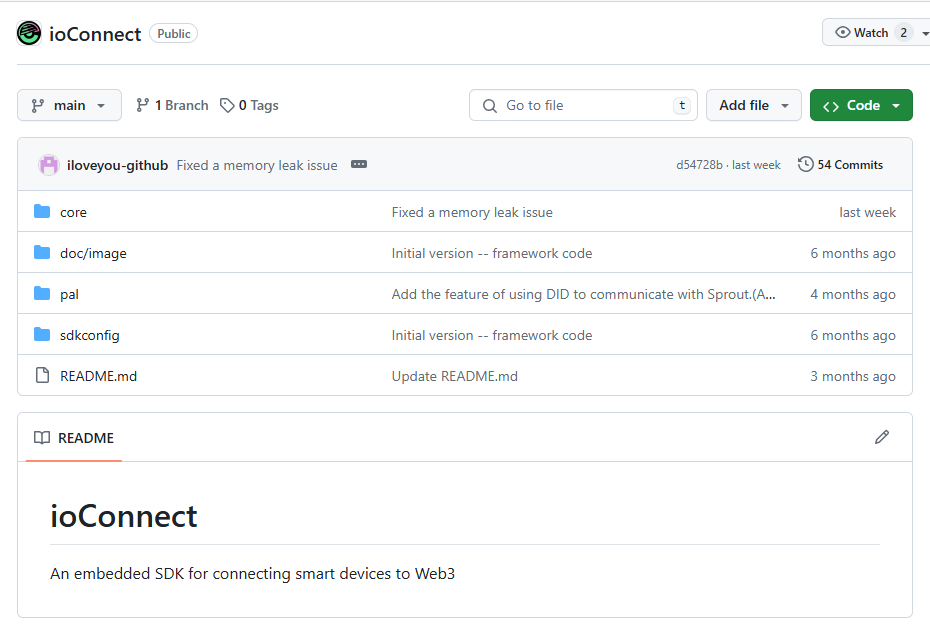
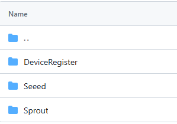

# ioConnect

An embedded SDK for connecting smart devices to Web3

​		ioConnect SDK is based on the previously developed PSACrypto SDK and adds implementations of protocols such as DID, DIDDoc, JOSE, and DIDComm on top of ARM PSA functionality. It is implemented in C language and enhances the cross-platform compatibility of the SDK.

​		The ioConnect SDK is primarily divided into two parts: the Core Layer and the Platform Adaptation Layer (PAL). The Core Layer provides functionality independent of the hardware platform, including implementations of PSA, DID, JOSE, and other protocols. The PAL layer optimizes the code according to the specific characteristics of different hardware platforms. For example, for the ESP platform, the SDK relies on its event messaging mechanism for code optimization, while for the Arduino platform, it implements communication functionality by inheriting the base class.

​		In the file structure of the Core Layer:

​		The `psa` and `crypto` folders primarily implement the Platform Security Architecture (PSA), which allows developers to use standardized and unified APIs to handle cryptography-related functions without concerning themselves with specific code implementation.

​		The `dids` folder mainly implements the functionality of the DID, DIDComm, and Verifiable Credential protocols, making it convenient for developers to handle operations related to these protocols. For example, developers can easily generate DID and DIDDoc information for their devices by calling methods provided by the DID component. They can also communicate with other devices using the DIDComm component.

​		The `jose` folder mainly implements the JOSE protocol suite, including JWK, JWS, JWE, and others.

​		In the file structure of the Platform Adaptation Layer (PAL), the SDK mainly implements methods for connecting to IoTeX decentralized network nodes. For example, the `DeviceRegister` component provides a method for terminal devices to register with the IoTeX Wallet, and the `Sprout` component allows easy communication with Sprout.

## Build

### 	ESP32 :

​			**[How to Create a Project on the ESP32 Platform](./doc/How_to_Create_a_Project_on_the_ESP32_Platform.md)**		

### 	Linux:

​			**[How to Create a Project on the Linux](./doc/How_to_Create_a_Project_on_the_Linux.md)**

### 	Windows:

​			**[How to Create a Project on the Windows](./doc/How_to_Create_a_Project_on_the_Windows.md)**

## Usage

### 	How to Generate a DIDDoc

​			Please view the documentation : **[How to Generate a DID Document Using ioConnect SDK](./doc/How_to_Generate_a_DID_Document_Using_ioConnectSDK.md)**

