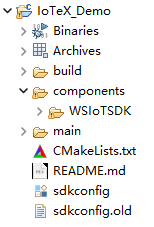
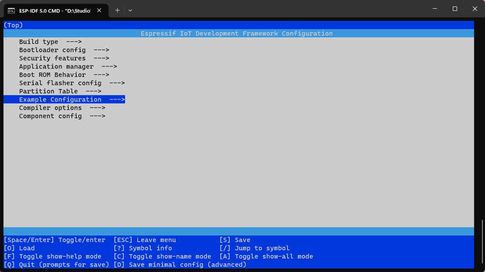

# Web3 Component for ESP32


The ESP23S3 can be developed using either Visual Studio Code or Eclipse, and this article uses the Eclipse for demonstration.


## Getting Started 

Please refer to the following documentation for setting up the environment for ESP32S3 development：

[Get Started - ESP32-S3 - — ESP-IDF Programming Guide latest documentation (espressif.com)](https://docs.espressif.com/projects/esp-idf/en/latest/esp32s3/get-started/index.html#get-started)


## Start a Project

- Create the **components** directory in the root directory of your project.
- Clone the component into the **components** directory of your project, or add it as a submodule.

The project structure is as follows:
<p>
  
</p>


## Configure Your Project

##### 1. Use the following command to configure your wifi information.

```
idf.py menuconfig
```

<p>
  
</p>

##### 2. Or double-click on the sdkconfig file in the Project Explorer on the left side of eclipse.

<p>
  
</p>

##### 3. Select Example Configuration and enter your Wifi SSID and PASSWORD.

<p>
  
</p>

<p>
  
</p>

## Test your project

##### 1. Compile with the following command. [Click on the Build button (or select the menu bar Project -- Build All).]

```
idf.py build
```

##### 2. Flash onto the Device.[Click on the Run button (or select the menu bar Run -- Run)]

```
idf.py flash
```

##### 3. If the device log outputs a message similar to the one below, it has successfully connected to the set Wifi hotspot.

```
I (856) example: wifi_init_sta finished.
I (2076) wifi:new:<11,0>, old:<1,0>, ap:<255,255>, sta:<11,0>, prof:1
I (3056) wifi:state: init -> auth (b0)
I (3086) wifi:state: auth -> assoc (0)
I (3126) wifi:state: assoc -> run (10)
W (3256) wifi:<ba-add>idx:0 (ifx:0, 48:0e:ec:7a:41:52), tid:0, ssn:2, winSize:64
I (3256) wifi:connected with mySSID, aid = 2, channel 11, BW20, bssid = xx:xx:xx:xx:xx:xx
I (3256) wifi:security: WPA2-PSK, phy: bgn, rssi: -36
I (3376) wifi:pm start, type: 1

I (3376) wifi:set rx beacon pti, rx_bcn_pti: 0, bcn_timeout: 0, mt_pti: 25000, mt_time: 10000
I (3376) wifi:BcnInt:102400, DTIM:1
W (3396) wifi:<ba-add>idx:1 (ifx:0, 48:0e:ec:7a:41:52), tid:6, ssn:1, winSize:64
I (4156) esp_netif_handlers: sta ip: 192.168.1.226, mask: 255.255.255.0, gw: 192.168.1.1
I (4156) example: got ip:192.168.1.226
I (4156) example: connected to ap SSID:mySSID password:myPASSWORD
```


## Get Devnet Configuration Parameters

##### You need to create the project and device from the w3bstream studio page and get the token and mqtt topic, for more detailed instructions, please see the following documentation:

[How to create a w3bstream studio project](./doc/How_to_create_a_w3bstream_studio_project.md)


## Use IOTEX WSIoTSDK

##### 1. Add header file.

```c++
#include "DeviceConnect_Core.h"
```

##### 2. Add SDK initialization code.

```c
time_t iotex_time_set_func(void)
{
    return time(NULL);
}

int iotex_mqtt_pubscription(unsigned char *topic, unsigned char *buf, unsigned int buflen, int qos)
{
	return esp_mqtt_client_publish(mqtt_client, (const char *)topic, (const char *)buf, buflen, 1, qos);
}

int iotex_mqtt_subscription(unsigned char *topic)
{
    return esp_mqtt_client_subscribe(mqtt_client, (const char *)topic, 0);
}

void app_main(void) {

    .......
    iotex_deviceconnect_sdk_core_init(iotex_time_set_func, iotex_mqtt_pubscription, iotex_mqtt_subscription);
    .......
}

```

##### 3. project configuration

Fill the **token** and **mqtt topic** obtained through **w3bstream studio** into the **iotex_dev_access_config.h** file:

```c
#define IOTEX_TOKEN_DEFAULT		        "eyxxxxxxxxxxxxxxxxxxxxxxxxxxxxxxxxx"
#define IOTEX_MQTT_TOPIC_DEFAULT		"eth_xxxxxxxxxxxxxxxxxxx_esp32_hello"
```

##### 4. For details, please refer to the ESP32S3 project example.

##### 5. The project examples provide several examples for uploading user data to w3bstream:

```c
void iotex_devnet_upload_data_example_json(void);
void iotex_devnet_upload_data_example_pb(void);
void iotex_devnet_upload_data_example_raw(void);
```

##### 6. The user does not need to care about the details of the device's data interaction with w3bstream.

##### 8. All you need to do is pass the data you want to report into the SDK as shown in the example in step 5.


## IOTEX WSIoTSDK Reference

##### For more information about Iotex WSIoTSDK, please refer to the following document:

[WSIoTSDK User Manual](./doc/WSIoTSDK_User_Manual.md)
