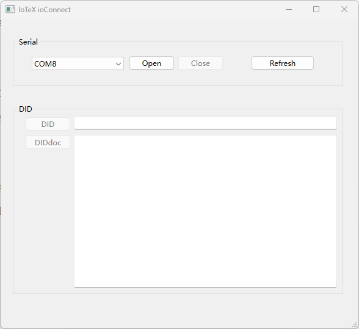
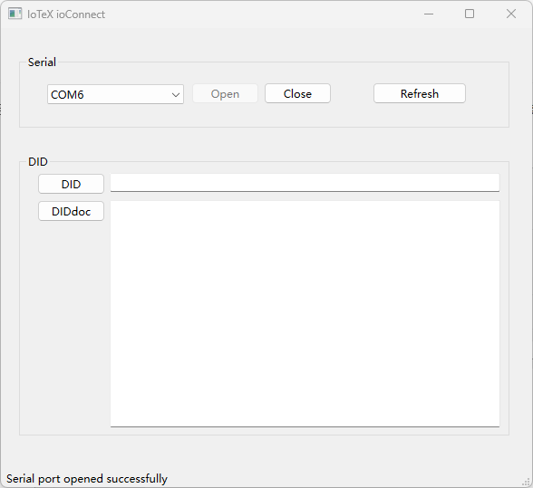
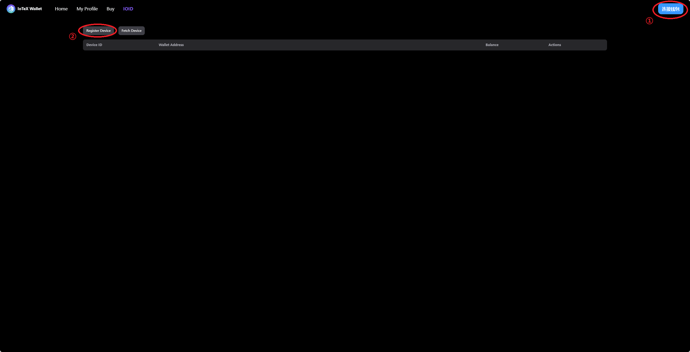
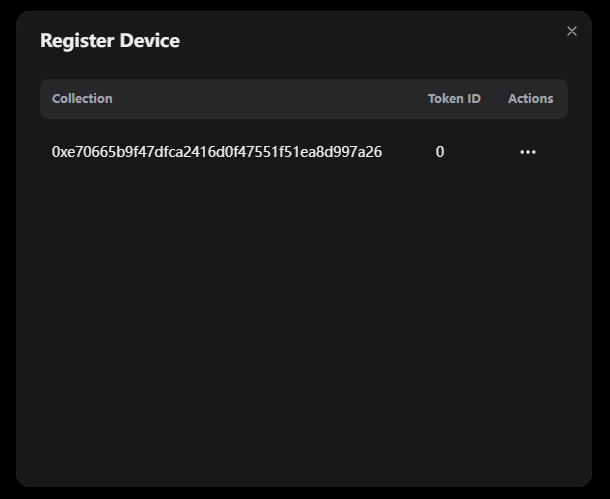
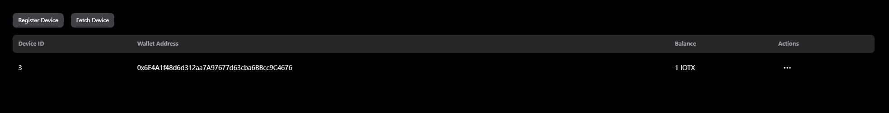

# Device Registration 

In the file structure of the Platform Adaptation Layer (PAL), the SDK mainly implements methods for connecting to IoTeX decentralized network nodes. For example, the `DeviceRegister` component provides a method for terminal devices to register with the IoTeX Wallet, and the `Sprout` component allows easy communication with Sprout.

## Process

1. Start the device and connect it to the computer via a serial port. This can be done through USB, emulating a serial port in any form, such as CDC-ACM, or by using a CH340 chip for bridging.

2. Launch the IoTeX ioConnect desktop tool.

3. Select the corresponding serial port for the device and click the Open button. The status bar at the bottom left will display "Serial port opened successfully", and the buttons for DID and DIDDoc will be enabled.

4. Click on DID and DIDDoc to obtain the device’s DID and DIDDoc. The device’s DID and DIDDoc will be displayed in the right-side text box.

5. Launch a browser and visit https://wallet.iotex.io/ioid

6. Connect the wallet.

7. Click on `Device Register`.

8. In the `Register Device` list, choose `...` in the `Action` column and click `Register`.

9. Upon successful registration, the device will appear in the list of devices.

