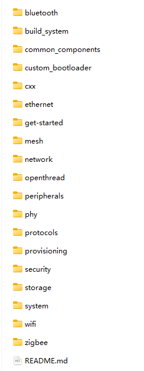
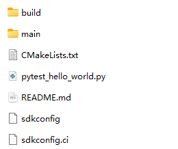
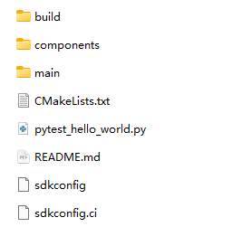
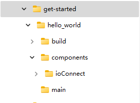
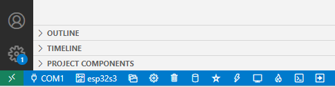
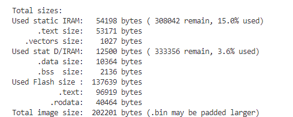

# How to Create a Project on the ESP32 Platform

​		The ioConnect SDK supports the ESP32 IDF build system, where the `core` can directly participate in the compilation as an ESP32 component. This document will guide you on how to create an ESP32 project from scratch based on the ioConnect SDK.

## Setting Up the ESP32 Development Environment

​		Please refer to the following documentation to set up the ESP32 development environment and ensure that ESP-IDF (Espressif IoT Development Framework) runs correctly on your system.

​		[Get Started - ESP32-S3 - — ESP-IDF Programming Guide latest documentation (espressif.com)](https://docs.espressif.com/projects/esp-idf/en/latest/esp32s3/get-started/index.html)

## Starting the Project

​		Once the ESP32 development environment is installed, you can start developing your ESP32 application. We recommend selecting an example from the `examples` directory in ESP-IDF that suits your development purpose. Let's take `get-started/hello_world` as an example.

​		

​		You can copy the `get-started/hello_world` project to your project directory. At this point, our project directory looks like the image below:

## Compiling the Project

- Create a `components` folder in the `hello_world` directory.

- Copy the entire `core` folder from the ioConnect SDK into `components`, and rename `core` to `ioConnect`.

- Open the `hello_world` project and configure the `Device Target`. (In this example, we use Visual Studio Code and ESP32S3 for demonstration)

- Compile the project. When the system outputs similar information, it indicates a successful compilation.

## Example

​		We provide an example of the ioConnect SDK on the ESP32 platform in the `example/esp32` directory.