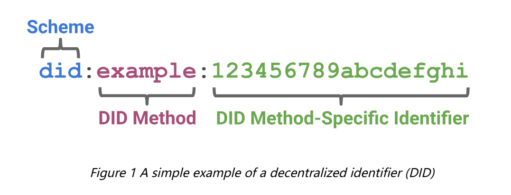

# How to Generate a DID for a device Using ioConnectSDK


Decentralized Identifiers (DIDs) are a new type of identifier that enables verifiable, self-sovereign digital identities. Unlike traditional identifiers, such as email addresses or usernames, which are controlled by centralized entities, DIDs are created, owned, and managed by the individual or entity themselves, without the need for a central authority. Here’s an overview of DIDs:

## Key Characteristics of DIDs

1. **Decentralization**:

   - DIDs are not dependent on a central registry, authority, or intermediary.
   - They are usually stored on distributed ledgers or decentralized networks, making them resilient to single points of failure and censorship.

2. **Self-Sovereignty**:

   - Individuals or entities have full control over their DIDs and the associated data.
   - They can create, update, and deactivate their DIDs without needing permission from a central authority.

3. **Interoperability**:

   - DIDs are designed to be interoperable across different systems and platforms.
   - They follow standards set by organizations like the World Wide Web Consortium (W3C).

4. **Privacy and Security**:

   - DIDs can enhance privacy by minimizing the need to share personal information.
   - They support cryptographic methods to ensure secure and verifiable interactions.

5. **Verifiable Claims**:

   - DIDs can be used to make verifiable claims or credentials (e.g., proof of identity, qualifications).

   - These claims can be independently verified without relying on a central authority.

     

## How DIDs Work

1. **Creation**:
   - A DID is created by generating a unique identifier and associated cryptographic keys.
   - The DID document, which contains metadata such as public keys and service endpoints, is stored on a decentralized network.
2. **Resolution**:
   - To use a DID, it needs to be resolved into a DID document.
   - This resolution process retrieves the DID document from the decentralized network, allowing the verifier to obtain the necessary information.
3. **Authentication**:
   - DIDs can be used to authenticate an entity by proving control over the associated private key.
   - This is typically done through cryptographic signatures.
4. **Verifiable Credentials**:
   - DIDs can issue and manage verifiable credentials.
   - These credentials can be presented to and verified by others, without needing to contact the issuer.


## Standards and Protocols

- **W3C DID Specification**:

  - The W3C has developed a standardized specification for DIDs, ensuring interoperability and consistency across implementations.
  - [Decentralized Identifiers (DIDs) v1.0 (w3.org)](https://www.w3.org/TR/2022/REC-did-core-20220719/)

- **DID Methods**:

  - Different DID methods define how DIDs are created, resolved, and managed on various decentralized networks (e.g., DID:ethr for Ethereum, DID:sov for Sovrin，DID: io for IoTeX).

    



A [DID](https://www.w3.org/TR/2022/REC-did-core-20220719/#dfn-decentralized-identifiers) is a simple text string consisting of three parts: 

1) the `did` URI scheme identifier, 
2) the identifier for the [DID method](https://www.w3.org/TR/2022/REC-did-core-20220719/#dfn-did-methods)
3) the DID method-specific identifier.


The ioConnect SDK has designed some definitions and methods to enable developers to quickly and conveniently generate a DID for a device.

Each DID method specifies the way to generate a DID Method-Specific Identifier. We will use the "io" method as an example to illustrate the generation of a DID.

To generate a DID using the "io" method, you first need to generate a JWK for the device. The following method can be used to generate a JWK:

```c
// Create a JWK.
// Params [enum JWKType] : a type of JWK. See Definition.
// Params [enum JWKSupportKeyAlg] : JWK supports key algorithms. See Definition.
// Params [lifetime] : the lifetime of the key.
//			IOTEX_JWK_LIFETIME_PERSISTENT
//			IOTEX_JWK_LIFETIME_VOLATILE
// Params [key_usage] : the Usage of the Key. (For more information, please refer to PSA Standards)
//			PSA_KEY_USAGE_DERIVE
//			PSA_KEY_USAGE_SIGN_HASH
//			PSA_KEY_USAGE_VERIFY_HASH
//			PSA_KEY_USAGE_EXPORT
// Params [alg] : the alg of the Key. (For more information, please refer to PSA Standards)
//			PSA_ALG_ECDSA(PSA_ALG_SHA_256)
//			PSA_ALG_ECDH
// Params [alg][out] : return a id of the key.(For more information, please refer to PSA Standards)
// Return [JWK *] : a JWK if successful, or NULL if failed.

JWK *iotex_jwk_generate(enum JWKType type, enum JWKSupportKeyAlg keyalg,
                int lifetime, unsigned int key_usage, unsigned int alg, unsigned int *key_id);
```


```c
// Create a JWK from Secret.
// Params [secret] : a data buf of Secret.
// Params [secret_size] : a data buf length of the Secret.
// Params [enum JWKType] : a type of JWK. See Definition.
// Params [enum JWKSupportKeyAlg] : JWK supports key algorithms. See Definition.
// Params [lifetime] : the lifetime of the key.
//			IOTEX_JWK_LIFETIME_PERSISTENT
//			IOTEX_JWK_LIFETIME_VOLATILE
// Params [key_usage] : the Usage of the Key. (For more information, please refer to PSA Standards)
//			PSA_KEY_USAGE_DERIVE
//			PSA_KEY_USAGE_SIGN_HASH
//			PSA_KEY_USAGE_VERIFY_HASH
//			PSA_KEY_USAGE_EXPORT
// Params [alg] : the alg of the Key. (For more information, please refer to PSA Standards)
//			PSA_ALG_ECDSA(PSA_ALG_SHA_256)
//			PSA_ALG_ECDH
// Params [alg][out] : return a id of the key.(For more information, please refer to PSA Standards)
// Return [JWK *] : a JWK if successful, or NULL if failed.

JWK* iotex_jwk_generate_by_secret(uint8_t *secret, unsigned int secret_size, 
               enum JWKType type, enum JWKSupportKeyAlg keyalg,
               int lifetime, unsigned int key_usage, unsigned int alg, unsigned int *key_id);   
```


Once a JWK has been successfully generated for the device, you can use the following method to generate a DID:

```c
// Generate a DID from a JWK.
// Params [name] : DID method. See "Standards and Protocols". Currently the SDK supports the following methods: "io" and "key".
//				   Developers can add the required methods themselves.
// Params [JWK *] : JWK pointer generated by the method : "iotex_jwk_generate" or "iotex_jwk_generate_by_secret".
// Return [JWK *] : a JWK if successful, or NULL if failed.

char* iotex_did_generate(char *name, JWK *jwk);
```


You can use the following method to obtain the JSON information of the JWK:

```c
// Generate a info of JWK in JSON format.
// Params [JWK *] : JWK pointer generated by the method : "iotex_jwk_generate" or "iotex_jwk_generate_by_secret".
// Params [format] : Generate a formatted information if true, otherwise unformatted information is generated.
// Return [char *] : a info of JWK in JSON format if successful, or NULL if failed.

char *iotex_jwk_serialize(JWK *jwk, bool format);
```


You can also use the following method to destroy a JWK:

```c
// Destroy a JWK.
// Params [JWK *] : Need to destroy the JWK pointer.
// Return : None.

void iotex_jwk_destroy(JWK *jwk);
```


## Definition

### enum JWKType

```c
enum JWKType {
    JWKTYPE_EC,
    JWKTYPE_RSA,
    JWKTYPE_Symmetric,          
    JWKTYPE_OKP,    
};
```


### enum JWKSupportKeyAlg

```c
enum JWKSupportKeyAlg {
    JWK_SUPPORT_KEY_ALG_ED25519,
    JWK_SUPPORT_KEY_ALG_P256,
    JWK_SUPPORT_KEY_ALG_K256,
};
```


## Example

```c
unsigned int key_id = 1;    
JWK *signjwk = iotex_jwk_generate(JWKTYPE_EC, JWK_SUPPORT_KEY_ALG_K256,
                                  IOTEX_JWK_LIFETIME_PERSISTENT,
                                  PSA_KEY_USAGE_SIGN_HASH | PSA_KEY_USAGE_VERIFY_HASH | PSA_KEY_USAGE_EXPORT,
                                  PSA_ALG_ECDSA(PSA_ALG_SHA_256),
                                  &key_id);    
if (NULL == signjwk) {
    printf("Fail to Generate a JWK\n");
    return;
}

char *sign_jwk_serialize = iotex_jwk_serialize(signjwk, true);
if (sign_jwk_serialize)
    printf("JWK[Sign] : \n%s\n", sign_jwk_serialize);

unsigned int kakey_id = 2;    
JWK *kajwk = iotex_jwk_generate(JWKTYPE_EC, JWK_SUPPORT_KEY_ALG_P256,
                                IOTEX_JWK_LIFETIME_PERSISTENT,
                                PSA_KEY_USAGE_DERIVE,
                                PSA_ALG_ECDH,
                                &kakey_id);    
if (NULL == kajwk) {
    printf("Fail to Generate a JWK\n");
    return;
}

char *kajwk_serialize = iotex_jwk_serialize(kajwk, true);
if (kajwk_serialize)
    printf("JWK[KA] : \n%s\n", kajwk_serialize);   

char *mySignDID = iotex_did_generate("io", mySignJWK);
if (mySignDID)
    printf("My Sign DID : \t\t\t%s\n", mySignDID);

char *myKADID = iotex_did_generate("io", myKAJWK);
if (myKADID)
    printf("My Key Agreement DID : \t\t%s\n", myKADID);
```


## output

```
JWK[Sign] : {
        "crv":  "P-256",
        "x":    "V9RzT195DjgPRjkYFVRL7UHJmlxBvMiOYNQHZpKdpwA",
        "y":    "yaBIUhnWdAfgtBmP7oftugp1wZrlysaVfxXyK_t7zhg",
        "kty":  "EC",
        "kid":  "Key-p256-1"
}
JWK[KA] :
{
        "crv":  "P-256",
        "x":    "4pDY2LehS-OA8JEUkis0sHhqVxdvw_kBg-OFeKDfHw8",
        "y":    "Z_6M5gWrAIFwEW9uDcn492KobseMNmd6yigzuPOBPo8",
        "kty":  "EC",
        "kid":  "Key-p256-2147483617"
}
My Sign DID :                   did:io:0x1817f78db95962b63fadf22f1022dfd74aaacc9e
My Key Agreement DID :          did:io:0x93d67cf1b78ed64e1cd7e88b76b433e5dfd98ad6
```


