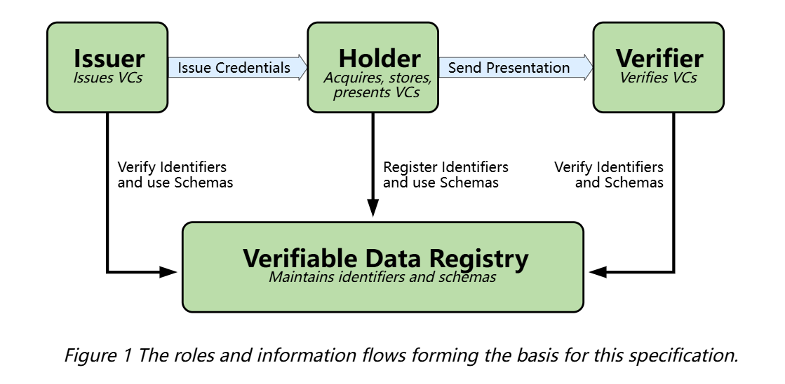

# How to Generate a Verifiable Credentials Using ioConnectSDK


## What is a Verifiable Credential?


In the physical world, a [credential](https://www.w3.org/TR/vc-data-model/#dfn-credential) might consist of:

- Information related to identifying the [subject](https://www.w3.org/TR/vc-data-model/#dfn-subjects) of the [credential](https://www.w3.org/TR/vc-data-model/#dfn-credential) (for example, a photo, name, or identification number)
- Information related to the issuing authority (for example, a city government, national agency, or certification body)
- Information related to the type of [credential](https://www.w3.org/TR/vc-data-model/#dfn-credential) this is (for example, a Dutch passport, an American driving license, or a health insurance card)
- Information related to specific attributes or properties being asserted by the issuing authority about the [subject](https://www.w3.org/TR/vc-data-model/#dfn-subjects) (for example, nationality, the classes of vehicle entitled to drive, or date of birth)
- Evidence related to how the [credential](https://www.w3.org/TR/vc-data-model/#dfn-credential) was derived
- Information related to constraints on the credential (for example, expiration date, or terms of use).

A [verifiable credential](https://www.w3.org/TR/vc-data-model/#dfn-verifiable-credentials) can represent all of the same information that a physical [credential](https://www.w3.org/TR/vc-data-model/#dfn-credential) represents. The addition of technologies, such as digital signatures, makes [verifiable credentials](https://www.w3.org/TR/vc-data-model/#dfn-verifiable-credentials) more tamper-evident and more trustworthy than their physical counterparts.

[Holders](https://www.w3.org/TR/vc-data-model/#dfn-holders) of [verifiable credentials](https://www.w3.org/TR/vc-data-model/#dfn-verifiable-credentials) can generate [verifiable presentations](https://www.w3.org/TR/vc-data-model/#dfn-verifiable-presentations) and then share these [verifiable presentations](https://www.w3.org/TR/vc-data-model/#dfn-verifiable-presentations) with [verifiers](https://www.w3.org/TR/vc-data-model/#dfn-verifier) to prove they possess [verifiable credentials](https://www.w3.org/TR/vc-data-model/#dfn-verifiable-credentials) with certain characteristics.

Both [verifiable credentials](https://www.w3.org/TR/vc-data-model/#dfn-verifiable-credentials) and [verifiable presentations](https://www.w3.org/TR/vc-data-model/#dfn-verifiable-presentations) can be transmitted rapidly, making them more convenient than their physical counterparts when trying to establish trust at a distance.

While this specification attempts to improve the ease of expressing digital [credentials](https://www.w3.org/TR/vc-data-model/#dfn-credential), it also attempts to balance this goal with a number of privacy-preserving goals. The persistence of digital information, and the ease with which disparate sources of digital data can be collected and correlated, comprise a privacy concern that the use of [verifiable](https://www.w3.org/TR/vc-data-model/#dfn-verify) and easily machine-readable [credentials](https://www.w3.org/TR/vc-data-model/#dfn-credential) threatens to make worse. This document outlines and attempts to address a number of these issues in Section [7. Privacy Considerations](https://www.w3.org/TR/vc-data-model/#privacy-considerations). Examples of how to use this data model using privacy-enhancing technologies, such as zero-knowledge proofs, are also provided throughout this document.

The word "verifiable" in the terms [verifiable credential](https://www.w3.org/TR/vc-data-model/#dfn-verifiable-credentials) and [verifiable presentation](https://www.w3.org/TR/vc-data-model/#dfn-verifiable-presentations) refers to the characteristic of a [credential](https://www.w3.org/TR/vc-data-model/#dfn-credential) or [presentation](https://www.w3.org/TR/vc-data-model/#dfn-presentations) as being able to be [verified](https://www.w3.org/TR/vc-data-model/#dfn-verify) by a [verifier](https://www.w3.org/TR/vc-data-model/#dfn-verifier), as defined in this document. Verifiability of a credential does not imply that the truth of [claims](https://www.w3.org/TR/vc-data-model/#dfn-claims) encoded therein can be evaluated; however, the issuer can include values in the [evidence](https://www.w3.org/TR/vc-data-model/#dfn-evidence) property to help the verifier apply their business logic to determine whether the claims have sufficient veracity for their needs.


## Ecosystem Overview

This section describes the roles of the core actors and the relationships between them in an ecosystem where [verifiable credentials](https://www.w3.org/TR/vc-data-model/#dfn-verifiable-credentials) are expected to be useful. A role is an abstraction that might be implemented in many different ways. The separation of roles suggests likely interfaces and protocols for standardization. The following roles are introduced in this specification:

- [holder](https://www.w3.org/TR/vc-data-model/#dfn-holders)

  A role an [entity](https://www.w3.org/TR/vc-data-model/#dfn-entities) might perform by possessing one or more [verifiable credentials](https://www.w3.org/TR/vc-data-model/#dfn-verifiable-credentials) and generating [verifiable presentations](https://www.w3.org/TR/vc-data-model/#dfn-verifiable-presentations) from them. Example holders include students, employees, and customers.

- [issuer](https://www.w3.org/TR/vc-data-model/#dfn-issuers)

  A role an [entity](https://www.w3.org/TR/vc-data-model/#dfn-entities) performs by asserting [claims](https://www.w3.org/TR/vc-data-model/#dfn-claims) about one or more [subjects](https://www.w3.org/TR/vc-data-model/#dfn-subjects), creating a [verifiable credential](https://www.w3.org/TR/vc-data-model/#dfn-verifiable-credentials) from these [claims](https://www.w3.org/TR/vc-data-model/#dfn-claims), and transmitting the [verifiable credential](https://www.w3.org/TR/vc-data-model/#dfn-verifiable-credentials) to a [holder](https://www.w3.org/TR/vc-data-model/#dfn-holders). Example issuers include corporations, non-profit organizations, trade associations, governments, and individuals.

- [subject](https://www.w3.org/TR/vc-data-model/#dfn-subjects)

  An [entity](https://www.w3.org/TR/vc-data-model/#dfn-entities) about which [claims](https://www.w3.org/TR/vc-data-model/#dfn-claims) are made. Example subjects include human beings, animals, and things. In many cases the [holder](https://www.w3.org/TR/vc-data-model/#dfn-holders) of a [verifiable credential](https://www.w3.org/TR/vc-data-model/#dfn-verifiable-credentials) is the subject, but in certain cases it is not. For example, a parent (the [holder](https://www.w3.org/TR/vc-data-model/#dfn-holders)) might hold the [verifiable credentials](https://www.w3.org/TR/vc-data-model/#dfn-verifiable-credentials) of a child (the [subject](https://www.w3.org/TR/vc-data-model/#dfn-subjects)), or a pet owner (the [holder](https://www.w3.org/TR/vc-data-model/#dfn-holders)) might hold the [verifiable credentials](https://www.w3.org/TR/vc-data-model/#dfn-verifiable-credentials) of their pet (the [subject](https://www.w3.org/TR/vc-data-model/#dfn-subjects)). For more information about these special cases, see Appendix [C. Subject-Holder Relationships](https://www.w3.org/TR/vc-data-model/#subject-holder-relationships).

- [verifier](https://www.w3.org/TR/vc-data-model/#dfn-verifier)

  A role an [entity](https://www.w3.org/TR/vc-data-model/#dfn-entities) performs by receiving one or more [verifiable credentials](https://www.w3.org/TR/vc-data-model/#dfn-verifiable-credentials), optionally inside a [verifiable presentation](https://www.w3.org/TR/vc-data-model/#dfn-verifiable-presentations), for processing. Example verifiers include employers, security personnel, and websites.

- [verifiable data registry](https://www.w3.org/TR/vc-data-model/#dfn-verifiable-data-registries)

  A role a system might perform by mediating the creation and [verification](https://www.w3.org/TR/vc-data-model/#dfn-verify) of identifiers, keys, and other relevant data, such as [verifiable credential](https://www.w3.org/TR/vc-data-model/#dfn-verifiable-credentials) schemas, revocation registries, issuer public keys, and so on, which might be required to use [verifiable credentials](https://www.w3.org/TR/vc-data-model/#dfn-verifiable-credentials). Some configurations might require correlatable identifiers for [subjects](https://www.w3.org/TR/vc-data-model/#dfn-subjects). Example verifiable data registries include trusted databases, decentralized databases, government ID databases, and distributed ledgers. Often there is more than one type of verifiable data registry utilized in an ecosystem.



## Definition

### enum ProofSuiteType

```c
enum ProofSuiteType {
    DataIntegrityProof,
    Ed25519Signature2020,
    Ed25519Signature2018,
    EcdsaSecp256k1Signature2019,
    EcdsaSecp256r1Signature2019,
    RsaSignature2018,
    JsonWebSignature2020,
    ProofSuiteTypeMax,
};
```


### enum DataIntegrityCryptoSuite

```c
enum DataIntegrityCryptoSuite {
    Eddsa2022 = 0,                          // rename = "eddsa-2022"
    JcsEddsa2022,                           // rename = "json-eddsa-2022"
    Ecdsa2019,                              // rename = "ecdsa-2019"
    JcsEcdsa2019,                           // rename = "jcs-ecdsa-2019"
    DataIntegrityCryptoSuiteMax,
};
```


## API

```c
// Create a Verifiable Credential handle.
// Params : None
// Return [vc_handle_t] : a Verifiable Credential handle if successful, or NULL if failed.

vc_handle_t iotex_vc_new(void);
```


```c
// Destroy a Verifiable Credential.
// Params [vc_handle_t] : a Verifiable Credential handle from ‘iotex_vc_new’.
// Return [did_status_t]: The result of function execution.

did_status_t iotex_vc_destroy(vc_handle_t handle);
```


```c
// Setting a property of the Verifiable Credential.
// Params [vc_handle_t] : a Verifiable Credential handle from ‘iotex_vc_new’.
// Params [build_type] : Construction Type.
//			IOTEX_VC_BUILD_PROPERTY_TYPE_CONTEXT
//			IOTEX_VC_BUILD_PROPERTY_TYPE_ID
//			IOTEX_VC_BUILD_PROPERTY_TYPE_TYPE 
//			IOTEX_VC_BUILD_PROPERTY_TYPE_CS 
//			IOTEX_VC_BUILD_PROPERTY_TYPE_ISSUER
//			IOTEX_VC_BUILD_PROPERTY_TYPE_ISSUER_DATE   
//			IOTEX_VC_BUILD_PROPERTY_TYPE_PROOF
//			IOTEX_VC_BUILD_PROPERTY_TYPE_STATUS
//			IOTEX_VC_BUILD_PROPERTY_TYPE_TERMOFUSE 
//			IOTEX_VC_BUILD_PROPERTY_TYPE_EVIDENCE 
//			IOTEX_VC_BUILD_PROPERTY_TYPE_SCHEMA
//			IOTEX_VC_BUILD_PROPERTY_TYPE_RS   
//			IOTEX_VC_BUILD_PROPERTY_TYPE_EXP
//			IOTEX_VC_BUILD_PROPERTY_TYPE_PROPERTY 
// Params [name] : name of property, all except IOTEX_VC_BUILD_PROPERTY_TYPE_PROPERTY will be ignored.
// Params [void *] : value.
// Return [did_status_t] : The result of function execution.

did_status_t iotex_vc_property_set(vc_handle_t handle, unsigned int build_type, char *name, void *value);
```


```c
// Create a sub property handle of Verifiable Credential.
// Params : None
// Return [property_handle_t] : a handle of sub property of Verifiable Credentialif successful, or NULL if failed.

property_handle_t iotex_vc_sub_property_new(void);
```


```c
// Setting a sub property of the Verifiable Credential.
// Params [property_handle_t] : a handle of a sub property of Verifiable Credential from ‘iotex_vc_sub_property_new’.
// Params [build_type] : Construction Type.
//			IOTEX_VC_BUILD_PROPERTY_SUB_TYPE_PRIVATE_STRING
//			IOTEX_VC_BUILD_PROPERTY_SUB_TYPE_PRIVATE_NUM
//			IOTEX_VC_BUILD_PROPERTY_SUB_TYPE_PRIVATE_BOOL 
//			IOTEX_VC_BUILD_PROPERTY_SUB_TYPE_PRIVATE_JSON 
//			IOTEX_VC_BUILD_PROPERTY_SUB_TYPE_ID
//			IOTEX_VC_BUILD_PROPERTY_SUB_TYPE_TYPE   
// Params [name] : name of property.
// Params [void *] : value.
// Return [did_status_t] : The result of function execution.

did_status_t iotex_vc_sub_property_set(property_handle_t handle, unsigned int build_type, char *name, void *value);
```


```c
// Destroy a sub property of VC.
// Params [property_handle_t] : a handle of a sub property of Verifiable Credential from ‘iotex_vc_sub_property_new’.
// Return [did_status_t] : The result of function execution.

did_status_t iotex_vc_sub_property_destroy(property_handle_t handle);
```


```c
// Output Verifiable Credential.
// Params [vc_handle_t] : a Verifiable Credential handle from ‘iotex_vc_new’.
// Params [format] : If true, the output is formatted, if false the output is unformatted.
// Return [char *] : a output of the Verifiable Credential if successful, or NULL if failed.

char *iotex_vc_serialize(vc_handle_t handle, bool format);
```


## Example

```c
vc_handle_t vc_handle = iotex_vc_new();
did_status = iotex_vc_property_set(vc_handle, IOTEX_VC_BUILD_PROPERTY_TYPE_CONTEXT, NULL, IOTEX_CREDENTIALS_V1_CONTEXT);
if (DID_SUCCESS != did_status) {
    printf("iotex_vc_property_set [%d] ret %d\n", IOTEX_VC_BUILD_PROPERTY_TYPE_CONTEXT, did_status);
    goto exit; 
}
did_status = iotex_vc_property_set(vc_handle, IOTEX_VC_BUILD_PROPERTY_TYPE_CONTEXT, NULL, "https://www.w3.org/2018/credentials/examples/v1");    
if (DID_SUCCESS != did_status) {
    printf("iotex_vc_property_set [%d] ret %d\n", IOTEX_VC_BUILD_PROPERTY_TYPE_CONTEXT, did_status);
    goto exit; 
}

did_status = iotex_vc_property_set(vc_handle, IOTEX_VC_BUILD_PROPERTY_TYPE_ID, NULL, "http://example.org/credentials/3731");    
if (DID_SUCCESS != did_status) {
    printf("iotex_vc_property_set [%d] ret %d\n", IOTEX_VC_BUILD_PROPERTY_TYPE_ID, did_status);
    goto exit; 
}

did_status = iotex_vc_property_set(vc_handle, IOTEX_VC_BUILD_PROPERTY_TYPE_TYPE, NULL, "VerifiableCredential");    
if (DID_SUCCESS != did_status) {
    printf("iotex_vc_property_set [%d] ret %d\n", IOTEX_VC_BUILD_PROPERTY_TYPE_TYPE, did_status);
    goto exit; 
}

did_status = iotex_vc_property_set(vc_handle, IOTEX_VC_BUILD_PROPERTY_TYPE_ISSUER | IOTEX_VC_BUILD_PROPERTY_SUB_TYPE_ID, NULL, mySignDID);    
if (DID_SUCCESS != did_status) {
    printf("iotex_vc_property_set [%d] ret %d\n", IOTEX_VC_BUILD_PROPERTY_TYPE_ISSUER | IOTEX_VC_BUILD_PROPERTY_SUB_TYPE_ID, did_status);
    goto exit; 
} 

did_status = iotex_vc_property_set(vc_handle, IOTEX_VC_BUILD_PROPERTY_TYPE_ISSUER_DATE, NULL, "2020-08-19T21:41:50Z");    
if (DID_SUCCESS != did_status) {
    printf("iotex_vc_property_set [%d] ret %d\n", IOTEX_VC_BUILD_PROPERTY_TYPE_ISSUER_DATE, did_status);
    goto exit; 
}

property_handle_t property_cs_handle = iotex_vc_sub_property_new();             
did_status = iotex_vc_sub_property_set(property_cs_handle, IOTEX_VC_BUILD_PROPERTY_TYPE_CS | IOTEX_VC_BUILD_PROPERTY_SUB_TYPE_ID, NULL, peerSignDID);
if (DID_SUCCESS != did_status) {
    printf("iotex_vc_sub_property_set [%d] ret %d\n", IOTEX_VC_BUILD_PROPERTY_TYPE_CS | IOTEX_VC_BUILD_PROPERTY_SUB_TYPE_ID, did_status);
    goto exit; 
}    
did_status = iotex_vc_property_set(vc_handle, IOTEX_VC_BUILD_PROPERTY_TYPE_CS, NULL, property_cs_handle);    
if (DID_SUCCESS != did_status) {
    printf("iotex_vc_property_set [%d] ret %d\n", IOTEX_VC_BUILD_PROPERTY_TYPE_CS, did_status);
    goto exit; 
}    

char * vc_serialize = iotex_vc_serialize(vc_handle, true);
if (vc_serialize)
    printf("VC :\n%s\n", vc_serialize);

iotex_vc_destroy(vc_handle);        
```


## output

```
VC :
{
        "@context":     ["https://www.w3.org/2018/credentials/v1", "https://www.w3.org/2018/credentials/examples/v1"],
        "id":   "http://example.org/credentials/3731",
        "type": ["VerifiableCredential"],
        "credentialSubject":    [{
                        "id":   "did:io:0x26792d0b4c7567da5c50bc3f4fa05d71c8ba12c6"
                }],
        "issuer":       {
                "id":   "did:io:0x1817f78db95962b63fadf22f1022dfd74aaacc9e"
        },
        "issuanceDate": "2020-08-19T21:41:50Z"
}
```


