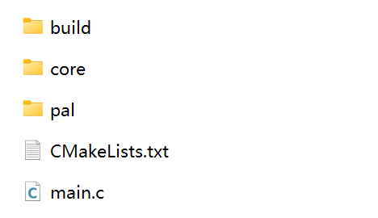

- #### This example requires Linux to have libmicrohttpd installed.

​		On Debian based systems like `Ubuntu`, you can use the following command:

```bash
sudo apt-get update
sudo apt-get install libmicrohttpd-dev
```

​		On `CentOS` or `RHEL` systems, `libmicrohttpd` can be installed using the `yum` or `dnf` package manager:

```bash
sudo yum install libmicrohttpd-devel
```

​		On `Fedora` systems, `libmicrohttpd` can be installed using the `dnf` package manager:

```bash
sudo dnf install libmicrohttpd-devel
```

​		On `Arch` Linux systems, `libmicrohttpd` can be installed using the `pacman` package manager:

```bash
sudo pacman -S libmicrohttpd
```


- #### Copy the entire `core` directory from the `SDK` directory to the current directory.

  

- #### Enter to the `core/src/include/config` directory.

  ```
  cd ./core/src/include/config
  ```

- #### Rename `autoconfig_linux.h` to `autoconfig.h`.

  ```
  rename autoconfig_linux.h autoconfig.h
  ```

- #### Create a `build` directory.

  ```
  cd ../../../../
  
  mkdir build
  ```

- #### Enter to the `build` directory.

  ```
  cd ./build
  ```

- #### Execute the command.

  ```
  cmake ..
  
  make
  ```

- #### Run the newly generated test program `DIDComm_Server`.

  ```
  ./DIDComm_Server
  ```

  

